Aquí tienes la **guía completa en formato Markdown**, lista para entregar o publicar en GitHub. Incluye las dos actividades (FTP y SFTP), explicaciones, comandos y espacio para evidencias.

***

# **Guía Práctica: Configuración de Servidores FTP y SFTP en Ubuntu**

## **Objetivo**

Configurar dos entornos diferenciados:

*   **Servidor FTP** (transferencia sin cifrado).
*   **Servidor SFTP** (transferencia segura sobre SSH).
    Comprobacion del tráfico con **Wireshark** desde un cliente Windows.

***

## **Requisitos previos**

*   Sistema operativo: **Ubuntu** (servidor).
*   Xarxa nat
*   Acceso con privilegios `sudo`.
*   Cliente Windows con **Wireshark** instalado.
*   Conexión de red entre ambos sistemas.

***

## **Actividad A: Servidor FTP (vsftpd)**

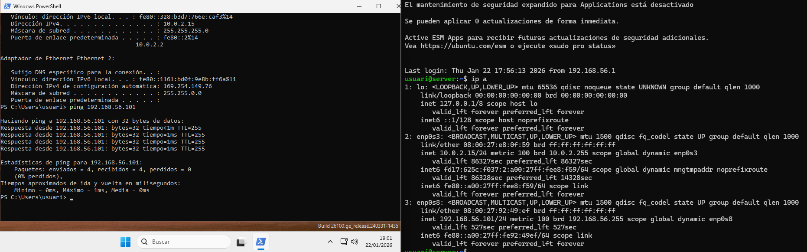

### **1. Actualizar el sistema**

```bash
sudo apt update && sudo apt upgrade -y
```

### **2. Instalar vsftpd**

```bash
sudo apt install vsftpd -y
```


### **3. Verificar estado del servicio**

```bash
sudo systemctl status vsftpd
```
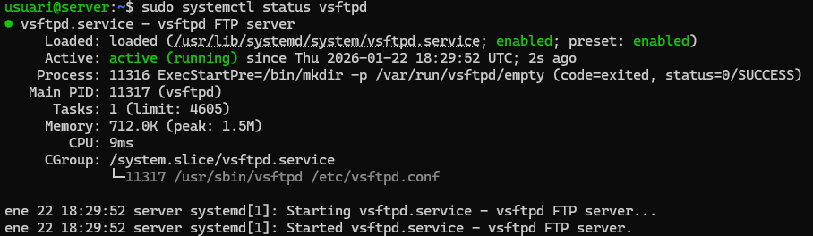

Si no está activo:

```bash
sudo systemctl start vsftpd
sudo systemctl enable vsftpd
```

### **4. Configurar vsftpd**

Archivo: `/etc/vsftpd.conf`

```bash
sudo nano /etc/vsftpd.conf
```

Modificar:

    listen=YES
    listen_ipv6=NO
    anonymous_enable=NO
    local_enable=YES
    write_enable=YES
    local_umask=022
    
    chroot_local_user=YES
    allow_writeable_chroot=YES
    
    pasv_enable=YES
    pasv_min_port=40000
    pasv_max_port=40010
    pasv_address=192.168.56.101
    
    user_sub_token=$USER
    local_root=/home/$USER/ftp

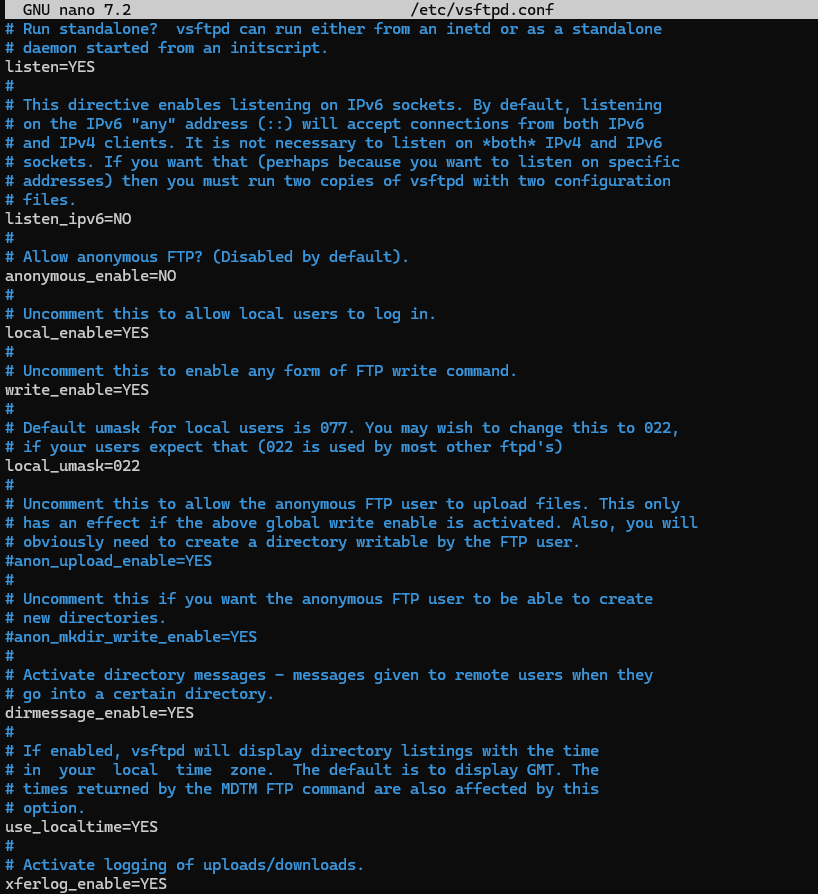
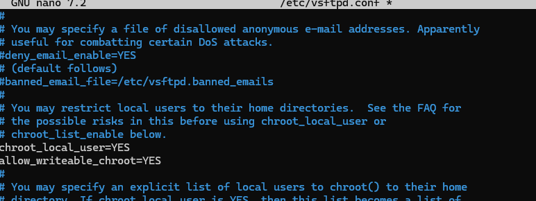
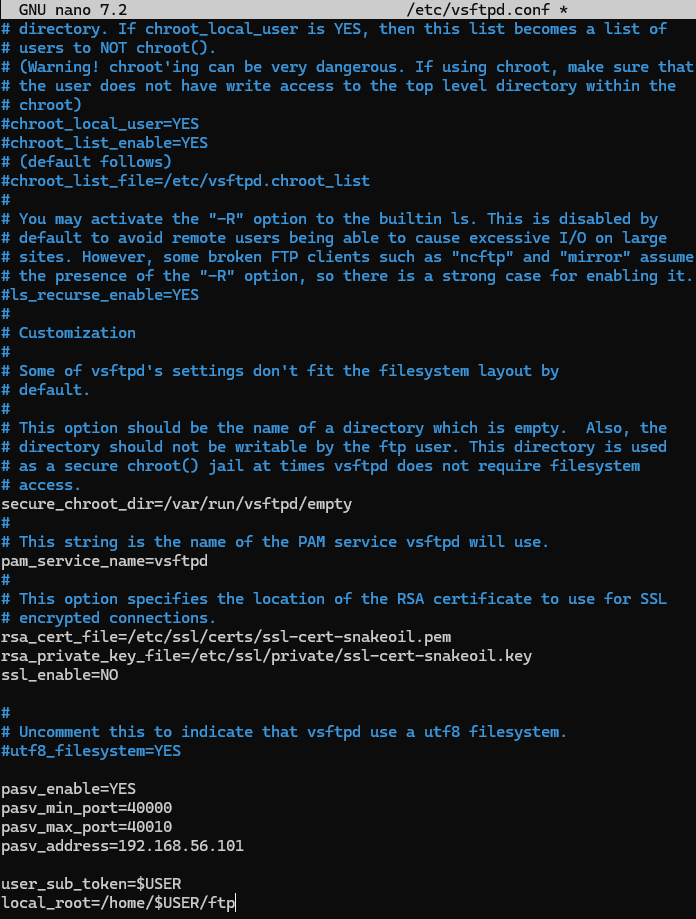

Guardar y reiniciar:

```bash
sudo systemctl restart vsftpd
```
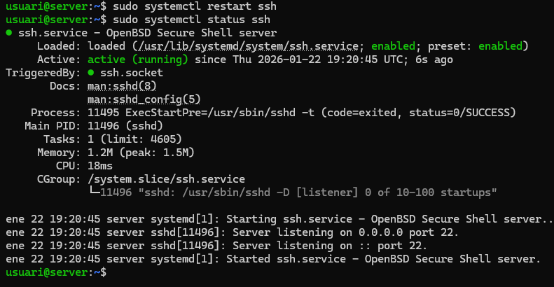

### **5. Abrir puertos**

```bash
sudo ufw allow 21/tcp
sudo ufw allow 40000:40010/tcp
sudo systemctl restart vsftpd
```
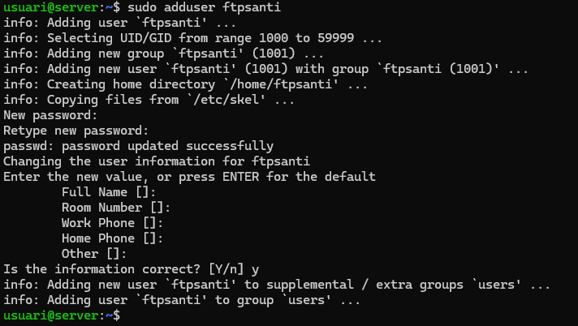


### **6. Crear usuario FTP**

```bash
sudo adduser ftp_tunombre
```


### **7. Crear y Dar permisos a los directorios**

```bash
sudo mkdir -p /home/ftpuser/ftp
sudo chown root:root /home/ftpuser
sudo chmod 755 /home/ftpuser
sudo chown ftpuser:ftpuser /home/ftpuser/ftp
```
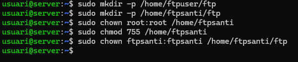


### **8. Comprobar tráfico en claro**

*   Conectar desde Windows (por ejemplo, con FileZilla).
*   Capturar con Wireshark → Filtrar por `ftp`.
*   Evidencia: credenciales visibles en texto plano.
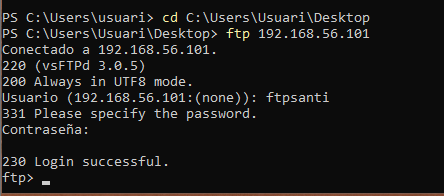
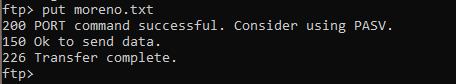
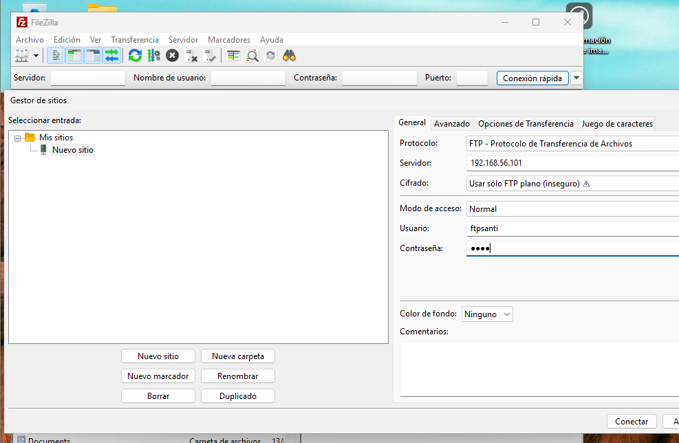
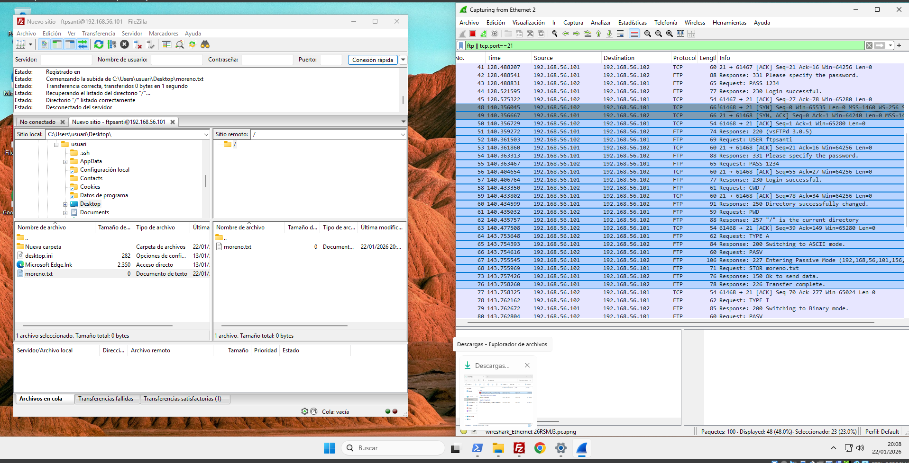
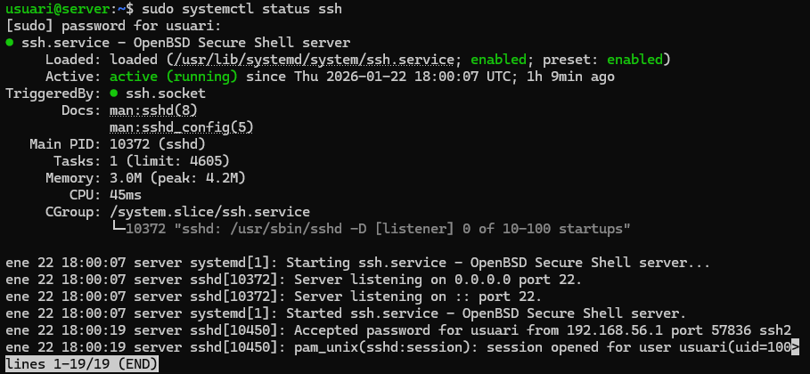
  ***

## **Actividad B: Servidor SFTP (sobre SSH)**

### **1. Instalar y verificar SSH**

```bash
sudo apt install openssh-server -y
sudo systemctl status ssh
```


### **2. Crear usuario SFTP**

```bash
sudo adduser sftp_tunombre
```
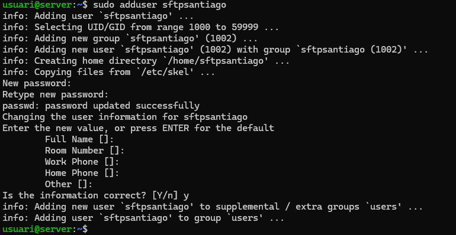

### **3. Crear directorio para chroot**

```bash
sudo mkdir -p /sftp/tunombre/upload
sudo chown root:root /sftp/tunombre
sudo chmod 755 /sftp/tunombre
sudo chown sftp_tunombre:sftp_tunombre /sftp/tunombre/upload
```
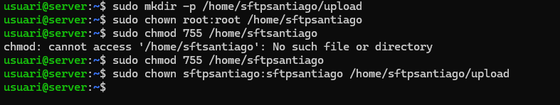

### **4. Configurar SSH para SFTP**

Archivo: `/etc/ssh/sshd_config`

```bash
sudo nano /etc/ssh/sshd_config
```

Añadir al final:

    Match User sftp_tunombre
        ChrootDirectory /sftp/tunombre
        ForceCommand internal-sftp
        AllowTcpForwarding no
        X11Forwarding no

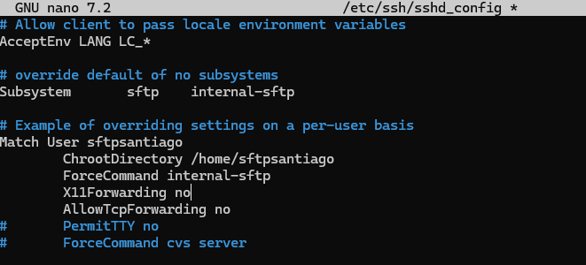

Reiniciar:

```bash
sudo systemctl restart ssh
```


### **5. Probar conexión SFTP**

```bash
sftp sftp_tunombre@localhost
```

Subir archivo:

```bash
put archivo.txt
```
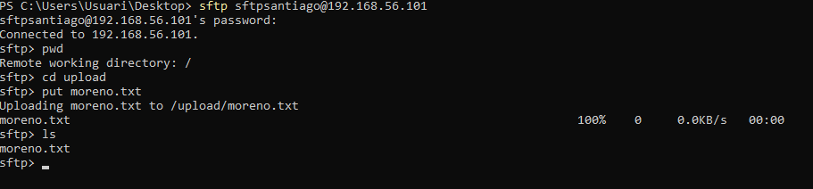

### **6. Comprobar tráfico cifrado**

*   Conectar desde Windows (WinSCP o FileZilla en modo SFTP).
*   Capturar con Wireshark → Filtrar por `ssh`.
*   Evidencia: tráfico cifrado (no se ven credenciales).

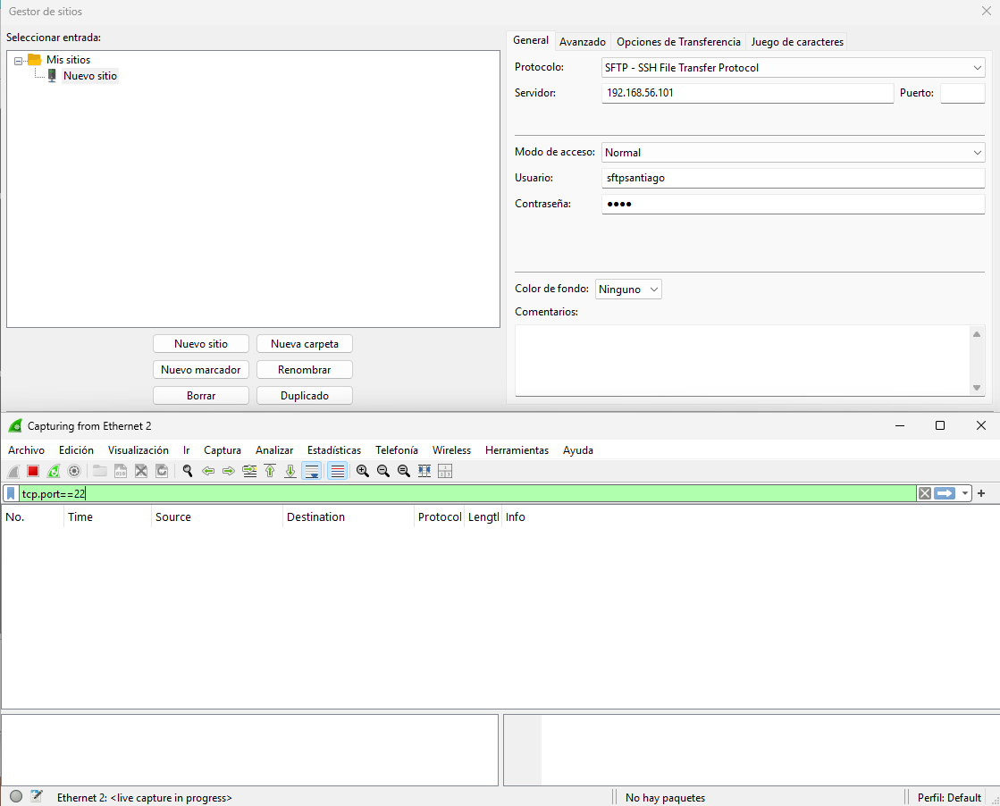
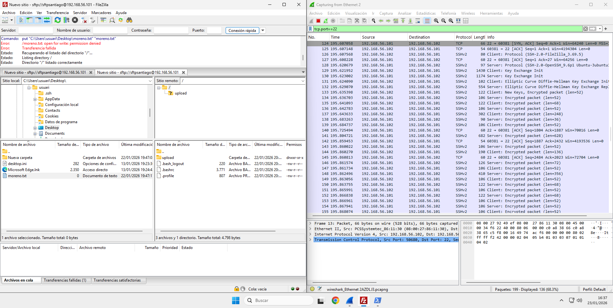

***

## **Comparativa FTP vs SFTP**

| Característica | FTP  | SFTP |
| -------------- | ---- | ---- |
| Cifrado        | No   | Sí   |
| Puerto         | 21   | 22   |
| Seguridad      | Baja | Alta |

