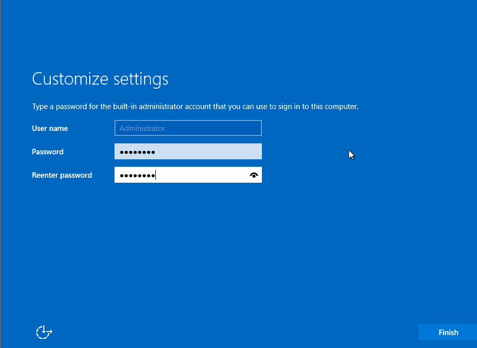

# Guia d’instal·lació de Windows Server 2025 en VirtualBox

## Introducció
Aquesta guia descriu el procés per crear i instal·lar una màquina virtual amb **Windows Server 2025** utilitzant **VirtualBox**.

---

## Especificacions de la màquina virtual
- **RAM:** 8 GB
- **Processadors:** 2
- **Discos:**
  - Principal: 32 GB (per al sistema operatiu)
  - Secundari: 10 GB (per dades)
- **Xarxes:**
  - Adaptador 1: NAT
  - Adaptador 2: Host-only
- **Sistema Operatiu:** Windows Server 2025 (GUI)
- **Idioma:** English (US)
- **Configuració regional i teclat:** Espanyol
- **Nom de l’equip:** DCxx (xx = número de llista)

---

## Fase 1: Creació de la màquina virtual

### Objectiu
Crear una màquina virtual amb els recursos i configuracions indicades.

### Passos
1. **Obrir VirtualBox**.
   - *[Captura: Pantalla principal de VirtualBox]*

2. **Crear nova màquina virtual**:
   - Nom: `WindowsServer2025-Test`
   - Tipus: Microsoft Windows
   - Versió: Windows 2022 (64-bit)
   - *[Captura: Pantalla de creació de VM]*

3. **Assignar memòria RAM**: 8192 MB.
   - *[Captura: Configuració de memòria]*

4. **Configurar CPU**: 2 processadors.
   - *[Captura: Configuració de CPU]*

5. **Afegir discos**:
   - Disc 1: 32 GB (VDI).
   - Disc 2: 10 GB (VDI).
   - *[Captura: Configuració d’emmagatzematge]*

6. **Configurar xarxes**:
   - Adaptador 1: NAT.
   - Adaptador 2: Host-only.
   - *[Captura: Configuració de xarxes]*

**Observació:** Configuració coherent amb requisits recomanats per Microsoft.

---

## Fase 2: Instal·lació de Windows Server 2025

### Objectiu
Instal·lar Windows Server 2025 en mode GUI amb idioma anglès i configuració regional espanyola.

### Passos
1. **Inserir la ISO**:
   - *[Captura: ISO carregada a VirtualBox]*

2. **Iniciar la màquina virtual**.
   - *[Captura: Pantalla inicial d’instal·lació]*

3. **Seleccionar idioma i configuració regional**:
   - Language: English (US)
   - Time and currency: Spanish (Spain)
   - Keyboard: Spanish
   - *[Captura: Pantalla de selecció d’idioma]*

4. **Instal·lar Windows Server 2025**:
   - Tria Windows Server 2025 Standard (Desktop Experience).
   - Accepta la llicència.
   - Instal·lació personalitzada al disc de 32 GB.
   - *[Captura: Pantalla de selecció d’edició]*

5. **Configurar contrasenya d’Administrator**.
   - *[Captura: Pantalla de configuració de contrasenya]* 

6. **Canviar nom de l’equip**:
   - Nom: `DCxx`.
   - Reinicia.
   - *[Captura: Pantalla de canvi de nom]*

7. **Actualitzar i pausar actualitzacions**:
   - Instal·la actualitzacions.
   - Pausa-les el màxim temps possible.
   - *[Captura: Pantalla de Windows Update]*

**Observació:** El mode GUI facilita la gestió visual del servidor.

---

## Fase 3: Comparativa amb requisits oficials
Segons [Microsoft Learn](https://learn.microsoft.com):
- RAM mínima: 2 GB (recomanat més).
- CPU: 1 processador.
- Disc: 32 GB mínim.
- Xarxa: Adaptador Ethernet.

**Conclusió:** La configuració proposada és superior als mínims i garanteix rendiment òptim.

---

## Fase 4: Observacions finals
- Pausar actualitzacions és clau per evitar interrupcions en entorns de prova.
- El segon disc pot utilitzar-se per dades o rols addicionals (ex. Active Directory).
- La configuració Host-only permet proves internes sense exposar el servidor a Internet.
