# REPTE: MALWARE I PROGRAMARI ANTIMALWARE

## Objetivo
Comprobar cómo funciona el malware y el software antimalware en un entorno seguro, realizando pruebas con:
- **EICAR** (archivo de prueba)
- **PSRansom** (simulación de ransomware)
- **WannaCry** (ransomware real en entorno controlado)

---

## FASE 1: Preparación de la máquina virtual

### Objetivo
Crear una instantánea (snapshot) para poder restaurar el estado inicial si algo sale mal.

### Pasos
1. Abre **VirtualBox**.
2. Selecciona la máquina virtual con **Windows 11**.
3. Haz clic en la pestaña **Instantáneas**.
4. Pulsa **Tomar instantánea**.
5. Asigna un nombre:  
   `Abans de proves antimalware`.

**Captura:**  
`[Inserta aquí la captura de la instantánea creada]`

---

## FASE 2: Desactivar SmartScreen y protección en tiempo real

### Objetivo
Permitir la descarga del archivo de prueba EICAR.

### Pasos
1. **Desactivar SmartScreen:**
   - Configuración → Privacidad y seguridad → Control de aplicaciones y navegador.
   - Desactiva:
     - Comprobar aplicaciones y archivos
     - SmartScreen para Microsoft Edge
     - Protección contra descargas

2. **Desactivar protección en tiempo real:**
   - Seguridad de Windows → Protección antivirus y contra amenazas → Configuración.
   - Desactiva **Protección en tiempo real**.

3. **Descargar EICAR:**
   - Accede a [https://www.eicar.org](https://www.eicar.org) y descarga el archivo de prueba.

**Capturas:**  
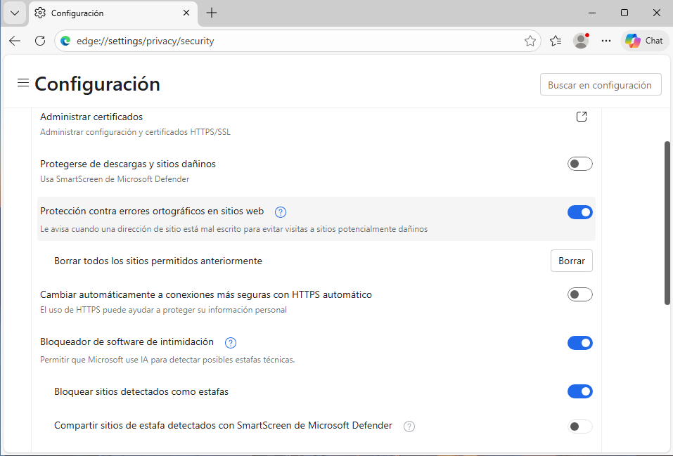
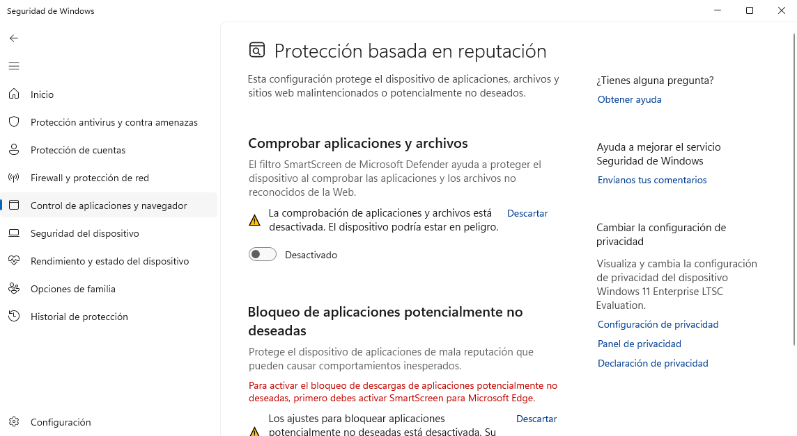 
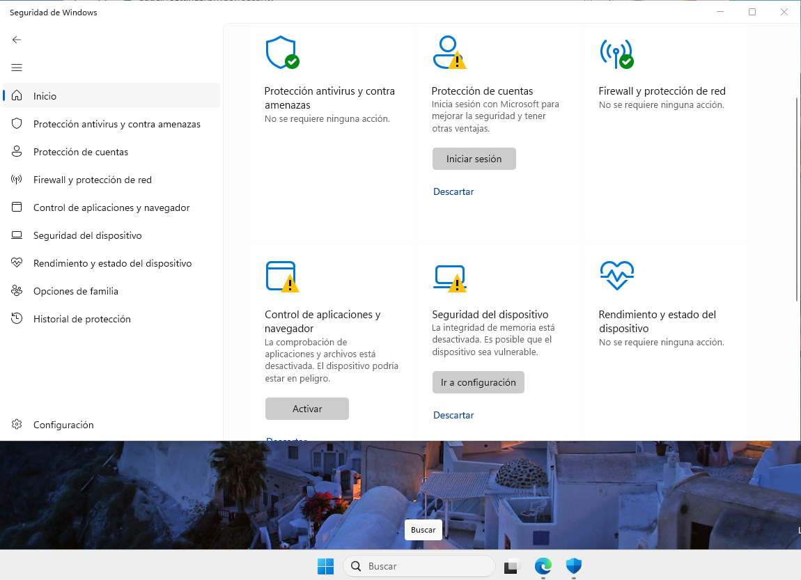
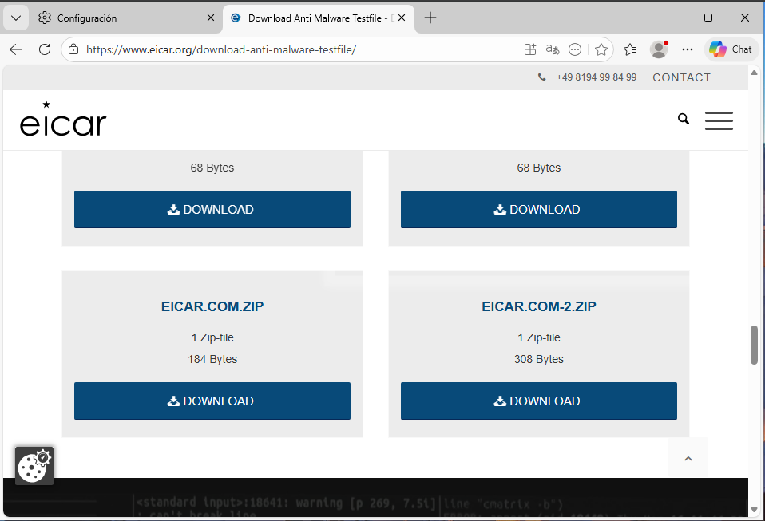
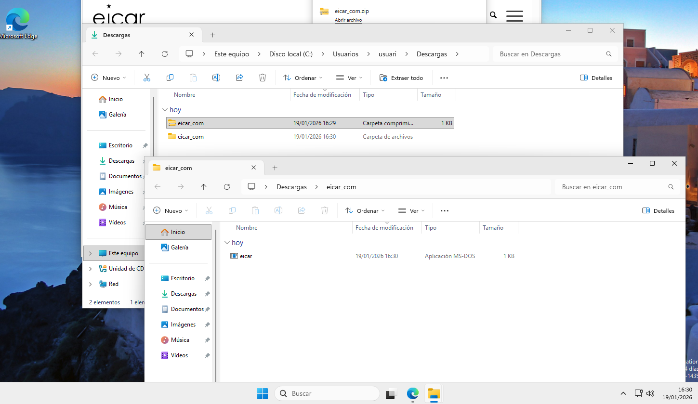

---

## FASE 3: Prueba con EICAR y compresión

### Objetivo
Comprobar si el antivirus detecta el archivo EICAR en diferentes formatos.

### Pasos
1. Reactiva la protección en tiempo real.
2. Analiza el archivo EICAR → debería detectarlo.
3. Desactiva la protección en tiempo real.
4. Comprime el archivo en:
   - `.zip`
   - `.tar`
   - `.7z`
5. Reactiva la protección y analiza cada archivo.

**Resultados esperados:**
- ZIP: Detectado
- TAR: Detectado
- 7z: Puede que no detectado

**Capturas:**  
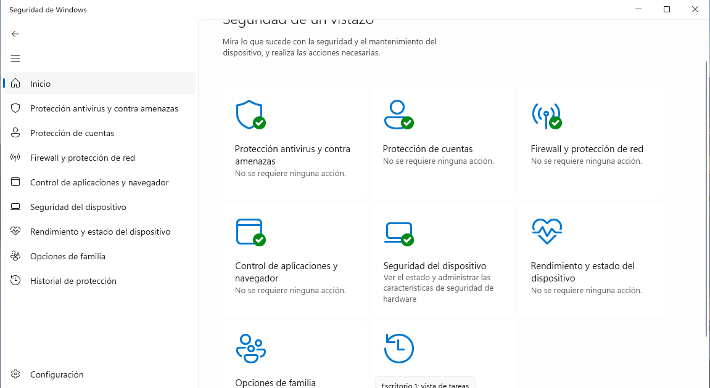
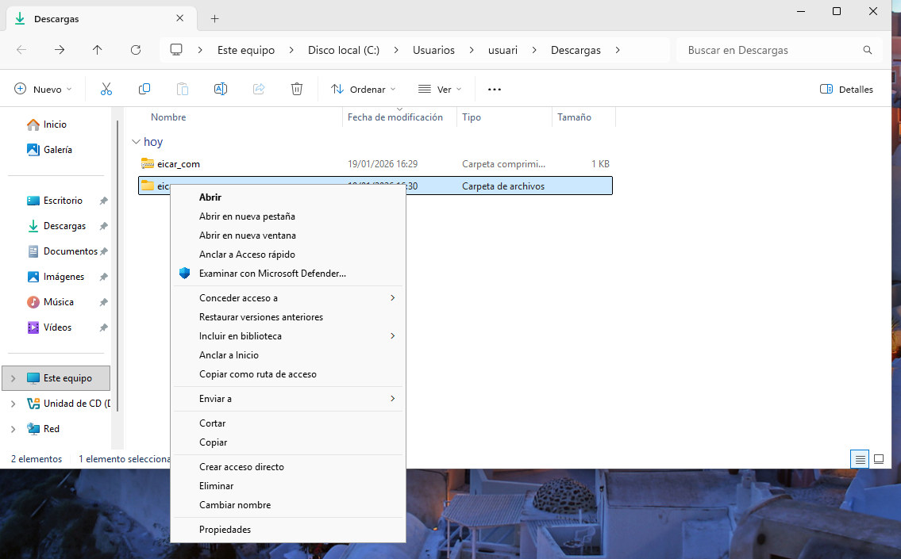
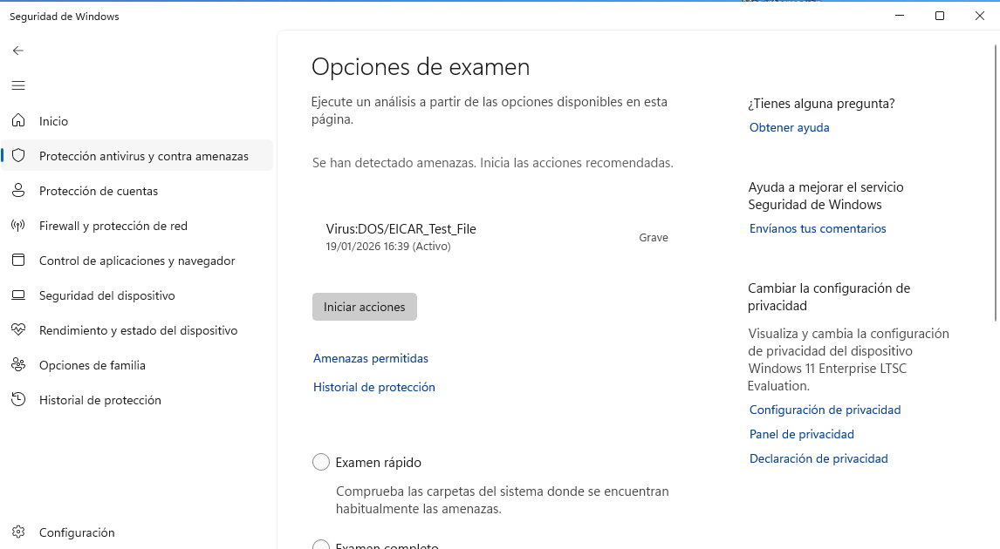

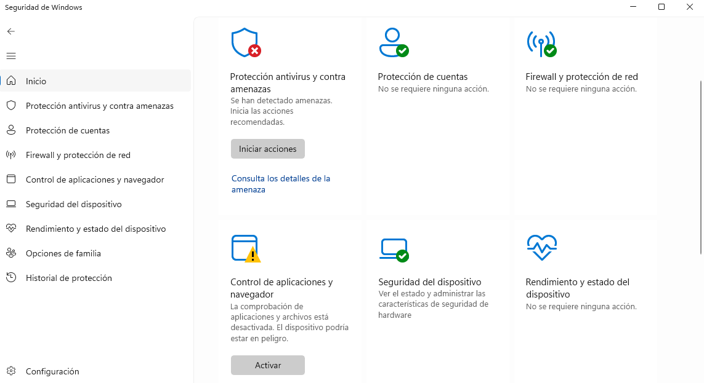
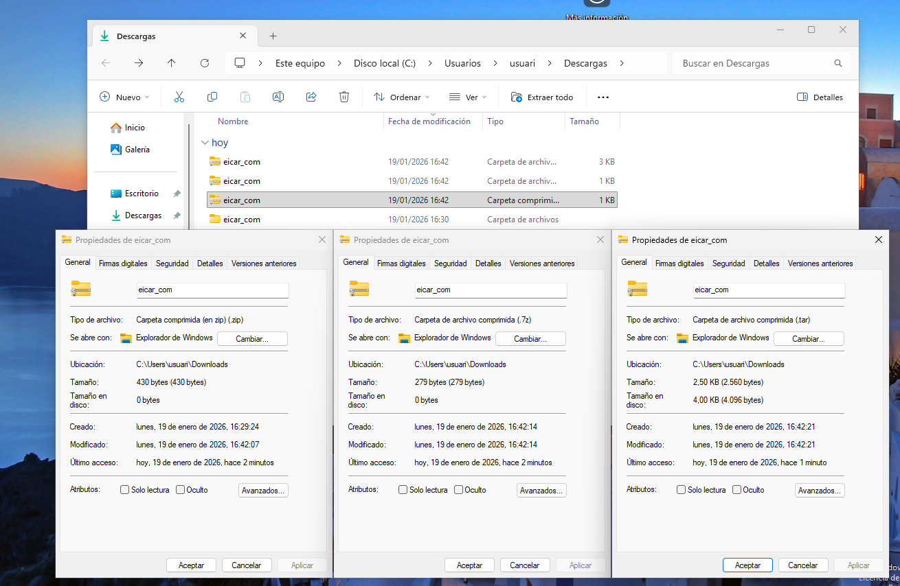
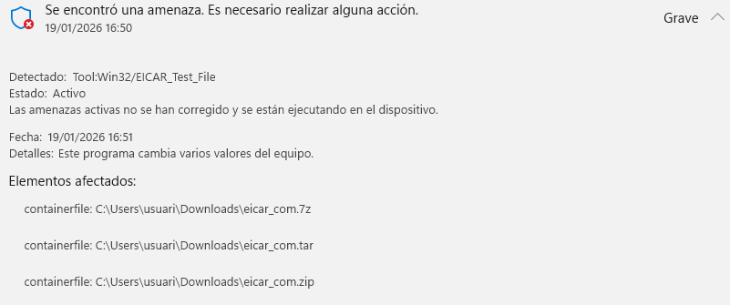

---

## FASE 4: Protecciones de Windows 11

### Pregunta
**¿Qué protecciones incorpora Windows 11?**

### Respuesta
- **Protección antivirus y contra amenazas:**
  - Protección en tiempo real
  - Protección basada en la nube
  - Protección contra manipulación

- **Control de aplicaciones y navegador:**
  - SmartScreen para aplicaciones y archivos
  - Protección contra descargas

- **Protección contra ransomware:**
  - Acceso controlado a carpetas
  - Copias de seguridad con OneDrive

---

## FASE 5: Prueba con PSRansom (simulación ransomware)

### Objetivo
Simular un ataque y comprobar la protección contra ransomware.

### Pasos
1. Crea archivos en **Documentos**.
2. Desactiva la protección contra ransomware.
3. Descarga PSRansom desde [https://github.com/JoelGMSec/PSRansom](https://github.com/JoelGMSec/PSRansom).
4. Permite ejecución de scripts:
   ```powershell
   Set-ExecutionPolicy -ExecutionPolicy unrestricted
5. Ejecuta cifrado:
PowerShell.\PSRansom.ps1 -e C:\Users\%USERNAME%\Documents -s 127.0.0.1 -p 80 -xMostra més línies
6. Comprueba archivos cifrados y archivo READ_ME.txt.
7. Descifra:
PowerShell.\PSRansom.ps1 -d C:\Users\%USERNAME%\Documents -k CLAVEMostra més línies
8. Activa protección contra ransomware y repite → archivos no cifrados.

Capturas:
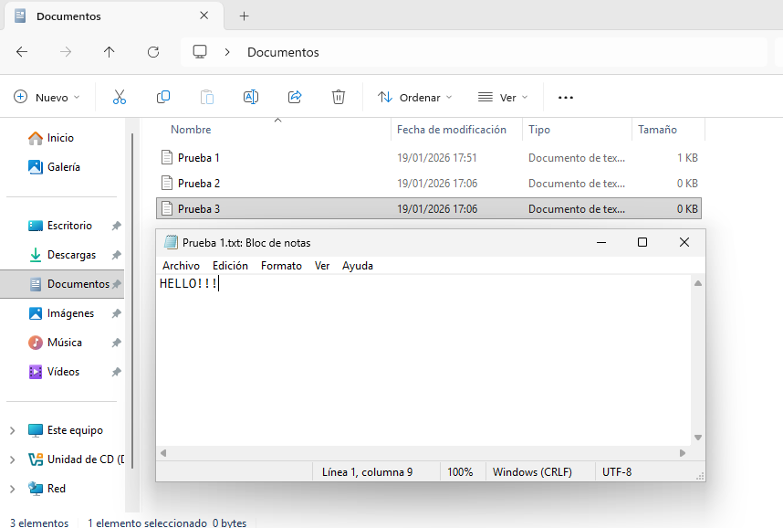
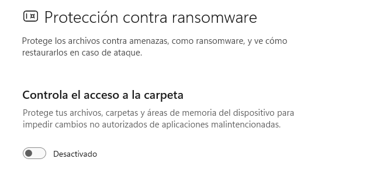
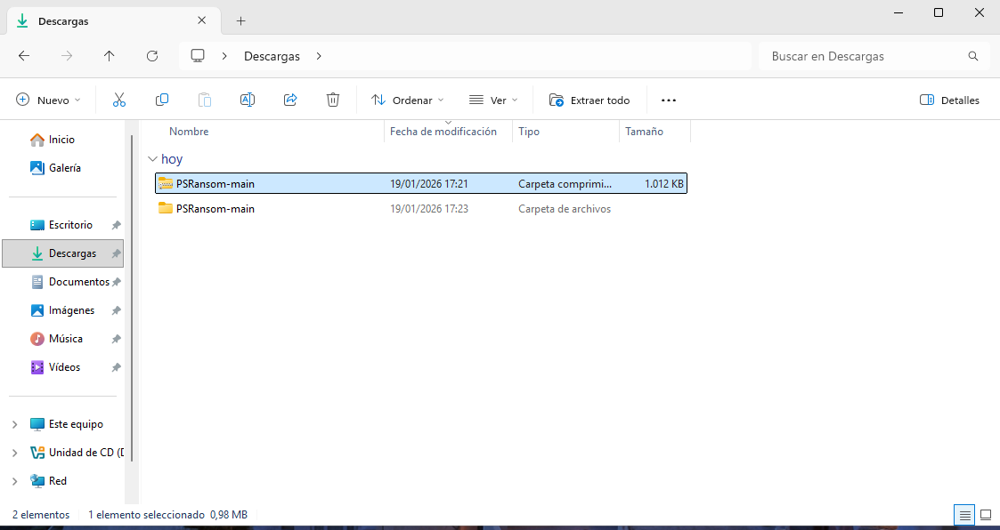
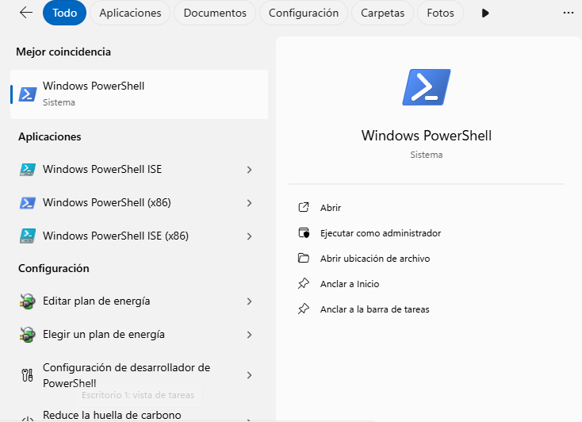
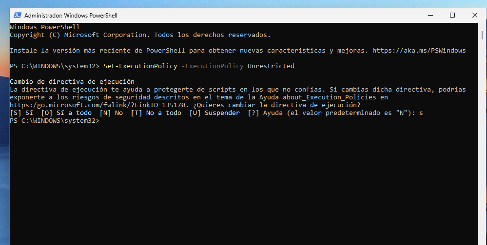
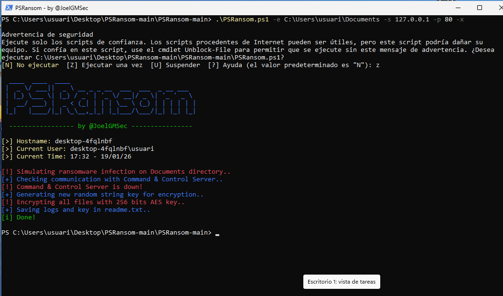
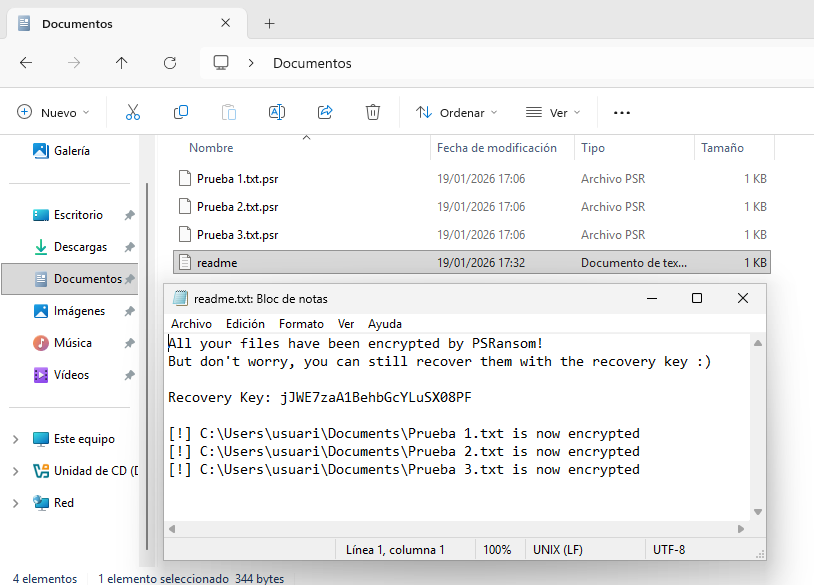
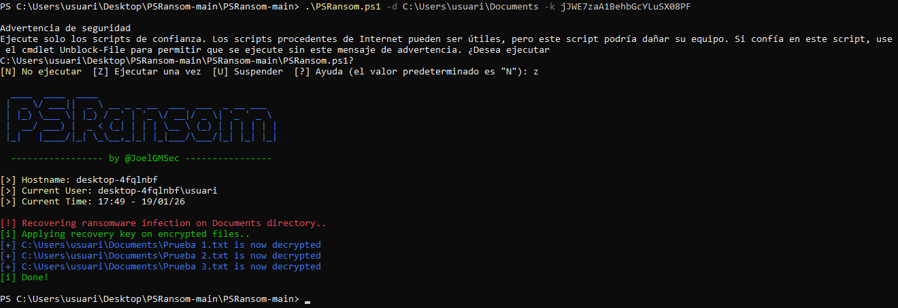
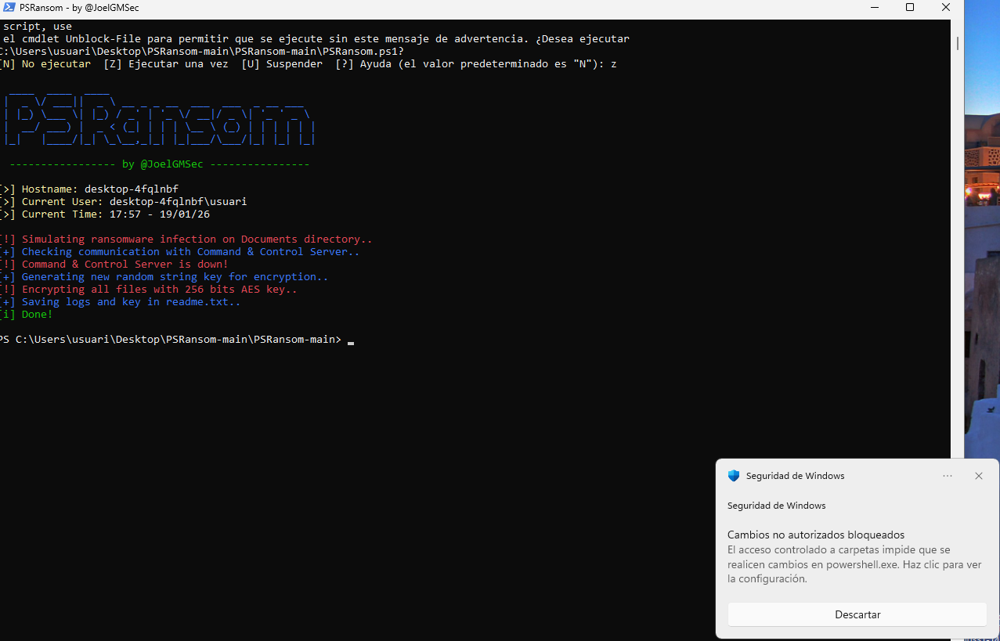

---

## FASE 6: WannaCry (Teoría + Prueba Controlada)

### Preguntas y Respuestas

- **¿Por qué se propaga tan rápido?**  
  WannaCry explota una vulnerabilidad en el protocolo SMB (Server Message Block) y actúa como un gusano (worm), lo que significa que se propaga automáticamente por la red sin intervención humana.

- **¿Qué vulnerabilidad utiliza?**  
  EternalBlue, identificada como **CVE-2017-0144**, que permite ejecución remota de código sin autenticación. Es una vulnerabilidad crítica.

- **¿Se debe pagar el rescate?**  
  No se recomienda pagar nunca:
  - No hay garantía de recuperar los archivos.
  - Financia el cibercrimen.
  Existen empresas negociadoras, pero es una práctica controvertida.

- **Medidas preventivas:**  
  - Instalar actualizaciones y parches de seguridad.
  - Desactivar SMBv1.
  - Mantener copias de seguridad offline.
  - Activar protección contra ransomware (Acceso controlado a carpetas).
  - Antivirus actualizado.

- **Si ya hemos sido atacados:**  
  - Desconectar el equipo de la red inmediatamente.
  - No reiniciar (puede perder la clave de cifrado).
  - Contactar con expertos en ciberseguridad.
  - Restaurar desde copias de seguridad.

---

### Prueba Práctica (Solo en Entorno Controlado)

**ATENCIÓN:**  
- Realizar únicamente en una máquina virtual sin conexión a Internet.  
- Tener una instantánea creada antes de ejecutar el malware.  
- No usar en equipos físicos ni en entornos de producción.

#### Pasos:

1. **Crear snapshot:**  
   Nombre: `Abans del virus`.

2. **Preparar archivos en la carpeta Documentos:**  
   - Archivos `.txt`, `.docx`, `.jpg`, `.pdf`.
   - Un archivo `.zip` con los anteriores.
   - Un `.zip` protegido con contraseña (ejemplo: `infected`).

3. **Descargar WannaCry:**  
   Desde el repositorio:  
   [https://github.com/ytisf/theZoo](https://github.com/ytisf/theZoo)  
   Contraseña para descomprimir: `infected`.

4. **Desactivar protecciones:**  
   - Protección en tiempo real de Windows Defender.
   - Protección contra ransomware.

5. **Descomprimir y ejecutar el malware:**  
   Ejecuta el archivo `.exe` de WannaCry.  
   **Resultado esperado:**  
   - Aparece la pantalla de rescate solicitando pago en Bitcoin.
   - Archivos en Documentos quedan cifrados.

6. **Comprobar detección del antivirus:**  
   - Si estaba activo, verifica si detectó el malware.
   - Si no, haz clic derecho sobre el `.exe` → **Analizar con Windows Defender**.

7. **Escanear con VirusTotal:**  
   [https://www.virustotal.com](https://www.virustotal.com)  
   Sube el archivo `.exe` (NO el `.zip` con contraseña).  
   Observa qué antivirus lo detectan y cuáles no.

8. **Restaurar la máquina:**  
   Apaga la máquina virtual y vuelve a la instantánea `Abans del virus`.

---

### Capturas:
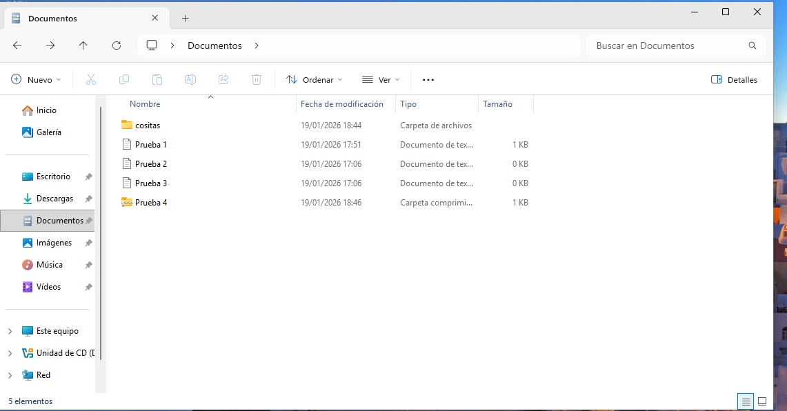
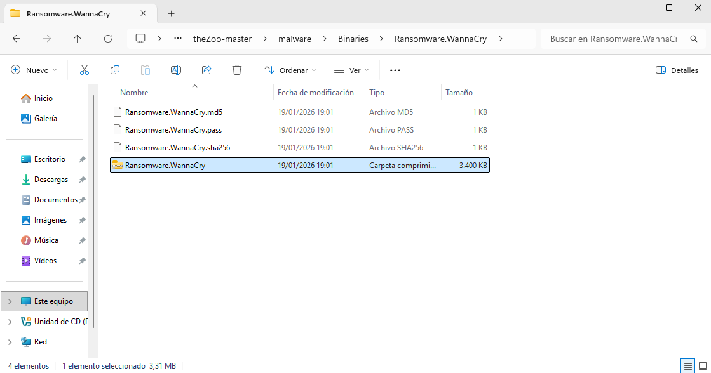
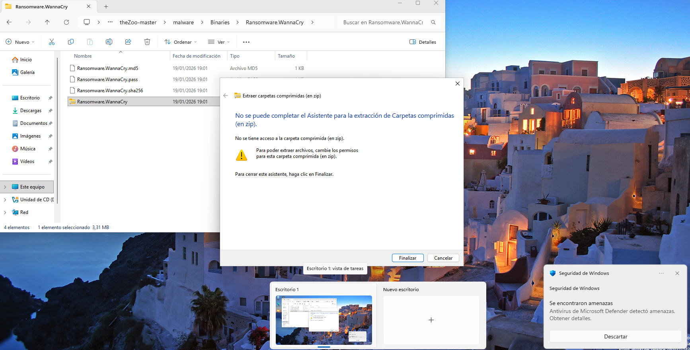

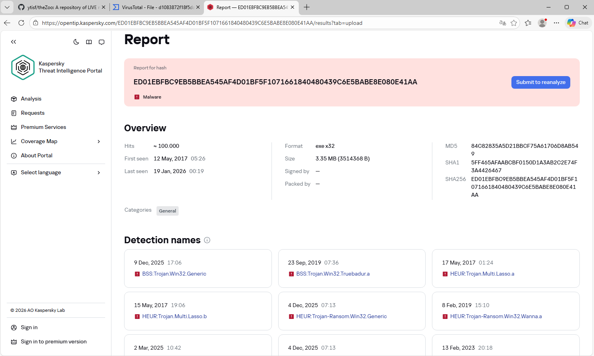

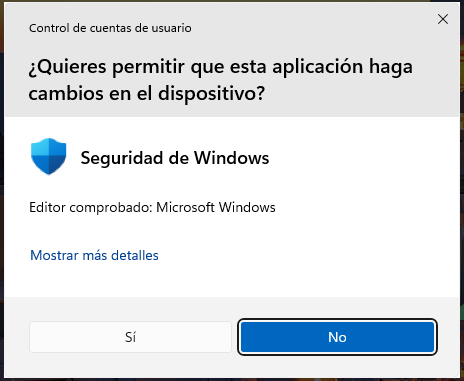
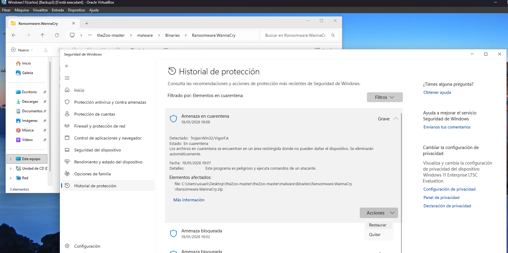
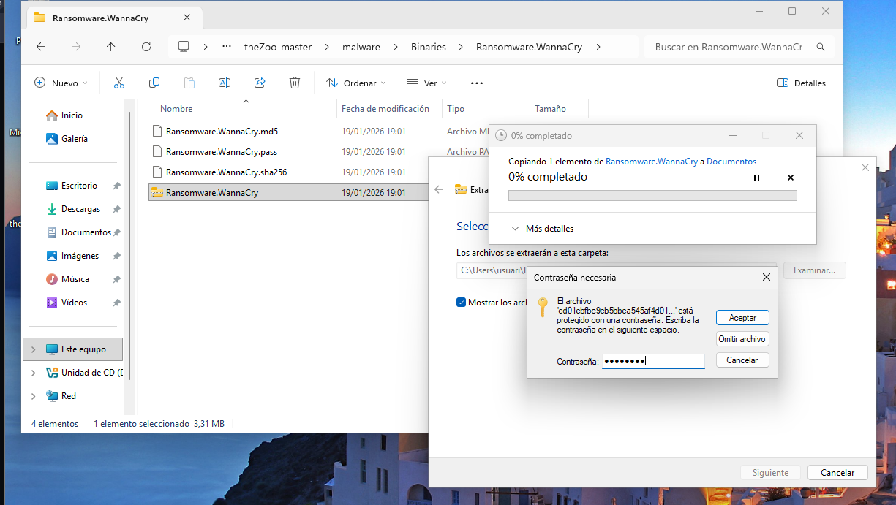
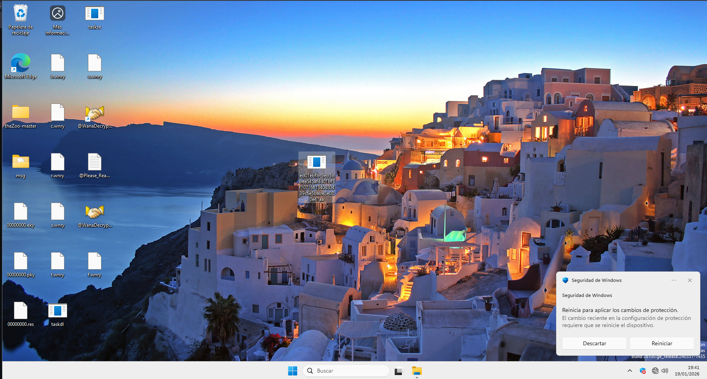
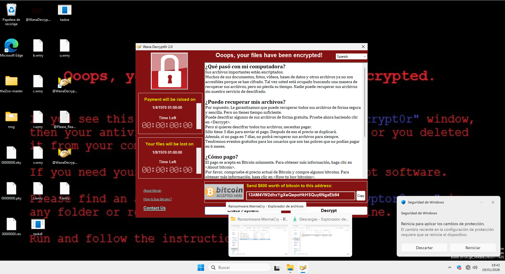
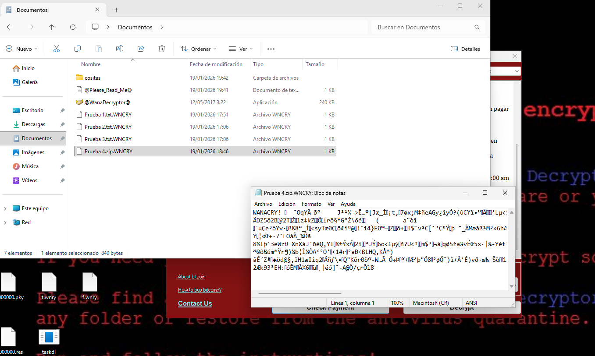

